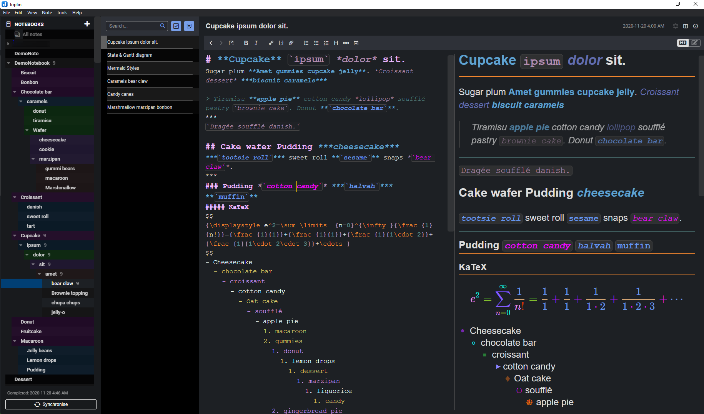
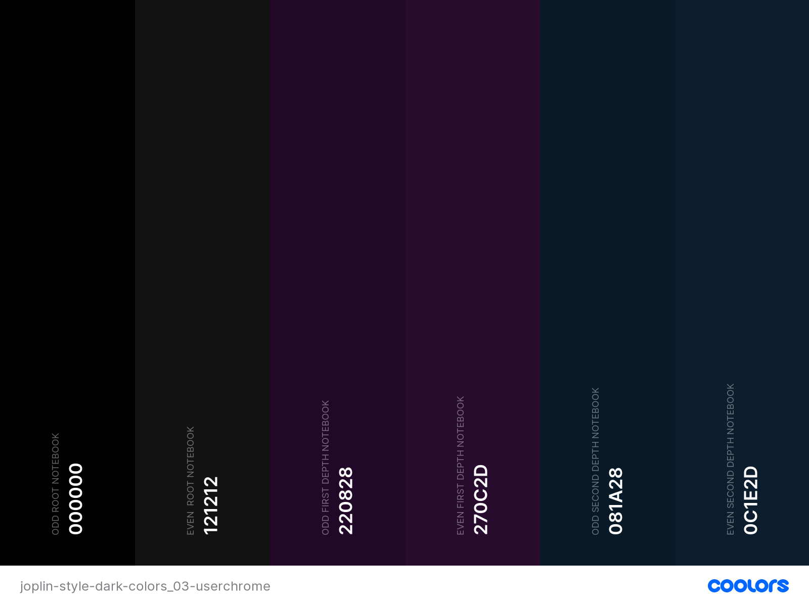

# joplin-style-dark-colors
Alternating rows on lists with muted colors, larger, bolder editing styles, KaTeX hues.

Refer to [Colored Rendered Markdown Stylesheet](#colored-rendered-markdown-stylesheet) and [Indented custom global stylesheet](#indented-custom-global-stylesheet) for details regarding each file.

Before, with final line partially hidden during editing:

After, with `Click to add tags...` optionally removed:

## Joplin
Download Joplin for your OS: 

https://joplinapp.org/

Custom CSS conversation: 

https://discourse.joplinapp.org/t/share-your-css/1730

## Installation
from 
https://joplinapp.org/#custom-css

Rendered markdown can be customized by placing a userstyle file in the profile directory `~/.config/joplin-desktop/userstyle.css` (This path might be different on your device - check at the top of the Config screen for the exact path). This file supports standard CSS syntax. Joplin must be restarted for the new css to be applied, please ensure that Joplin is not closing to the tray, but is actually exiting. Note that this file is used for both displaying the notes and printing the notes. Be aware how the CSS may look printed (for example, printing white text over a black background is usually not wanted).

The whole UI can be customized by placing a custom editor style file in the profile directory `~/.config/joplin-desktop/userchrome.css`.

Important: `userstyle.css` and userchrome.css are provided for your convenience, but they are advanced settings, and styles you define may break from one version to the next. If you want to use them, please know that it might require regular development work from you to keep them working. The Joplin team cannot make a commitment to keep the application HTML structure stable.

## Colored Rendered Markdown Stylesheet
`userstyle.css`

Adds horizontal rules to all headers, up to h5.

Increases font size and weight of all text for readability, and colorizes bold and italicized content.

Italicizes blockquotes, and adds color to inline code.

Colorized KaTeX output, unordered lists.

## Indented custom global stylesheet
`userchrome.css`

Fixed last editor line display cutoff by adding margin and padding to containers.

Alternating background colors for list items.

To preserve default highlighting of active list item, only affect the anchor inside the list item, leaving the left as an indented indicator; best compromise to full alternating row colors, as defined global styles override native dynamic css used to enable highlighting.

Also (optionally) removes `click to add tags` element, as it blocks the last line of editing and review windows, requiring either scrolling or extra whitespace at the end of long notes for last line visiblity.

Direct child specificity used to avoid cascading to nested divs, like styling bar.

Wider scrollbars for lists and editor.

Colorized header (`#`), bold, and italic styles, heavier bold weight, italicized blockqoute (text preceded by `>` on a new line).

Colorized KaTeX numbers, brackets, vars, and tags.

swatches powered by 
https://coolors.co

